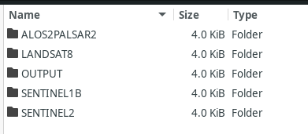

# Extraction of Flood Hazards From Areas-of-Interest (AOI) 

Containerized data processing workflows to extract flood hazards for Synthetic Aperture Radar (SAR) and optical imagery. The following sensors and platforms are supported:

1. ALOS2-PALSAR2 (SAR)
2. Sentinel1b (SAR)
3. Landsat 8 (Optical)
4. Sentinel2 (Optical)

### Repository Structure
- Each sensor (with the exception of Landsat8 and Sentinel2) have their own exclusive module in the `src` directory. This is because the raw data per sensor have different processing requirements, 
- The execution of the flood extraction workflow is facilitated by the `extract.py` script in each module. This script consolidates the pre-processing steps required for the raw data to be transformed to flood data. 
- The functions commonly used across the sensors are located in the `shared` directory.

### Pre-Usage Checklist

- For radar processing, ensure the pre- and post- event images have the same overlapping w. This is required for image differencing to extract flood pixels. 
- Ensure that all the input images were directly downloaded from the data provider AND not recompressed. This is to ensure that no artifacts are introduced along the way that may disrupt the operation of the modules.
- Ensure that the input datasets, aside from the imagery, are in the required coordinate reference system.
- Ensure that the input datasets are in the required format and compression (eg: .zip vs .rar).
- Ensure that the compressed datasets are in the required file structure as documented. 

### Usage

This project was designed to run on Linux machines with Docker. Please insure that Docker and Git are installed prior to running the modules for image processing. 

- The installation procedure for Docker may found in the Docker documentation [here](https://docs.docker.com/engine/install/ubuntu/).
- Git is preinstalled already in Ubuntu. However if you are in a situation where you need to install it you may find the instructions [here](https://github.com/git-guides/install-git#debianubuntu).

#### Setting up the Environment 

- If the modules are intended to be installed in a production system, it is highly recommended that you create a dedicated user account. 
- The user account must be part of the sudo group as well as the docker group to avoid permission errors when the modules attempt to create or access files on the host filesystem. Please refer to the following tutorials from DigitalOcean on how to accomplish these initial steps.

1. [How to create new `sudo` enabled user on Ubuntu](https://www.digitalocean.com/community/tutorials/how-to-create-a-new-sudo-enabled-user-on-ubuntu)
2. [Initial server setup with Ubuntu](https://www.digitalocean.com/community/tutorials/initial-server-setup-with-ubuntu)
3. [Executing Docker commands without `sudo`](https://www.digitalocean.com/community/tutorials/how-to-install-and-use-docker-on-ubuntu-20-04#step-2-executing-the-docker-command-without-sudo-optional)


#### Build modules

- Assuming Docker is installed correctly, run the `./build_all.sh`. This will build the Docker containers in your local machine that you can execute.

#### Executing the modules

- To execute a workflow for a sensor, use the `./run.sh` command (the run.sh script is found at the root of the repository). Please refer to the sections below for more detailed instructions on using each module.

```
Parameter list:
-s  Sensor name. Values accepted are: sentinel1b, alos2palsar2, landsat8, sentinel2
-a  Algorithm. Used only for optical sensors to specify processing algorithm. 
    Accepted values: ndwi, truecolor
-e  Event. Add event/typhoon name that will be part of the output file name. 
    Must be single word, no space.
-l  Location. Add location name that will be part of the output file name. 
    Must be single word, no space.
-p  Poverty Incidence. Specify the column name/header of the SHP file that contains
    the poverty incidence data.
-d  Digital Elevation Model. Specify the file name of the digital elevation model in
    the /data directory.
-b  Poverty Incidence .shp file. The modules will use the boundaries of the SHP to generate
    the flood impact map using overlap analysis.
```

- The default locations that the scripts will expect the input files for each sensor is located in the `data` directory located at the root of the repository.



- The following sections describe the data input requirements that must be present in the folders indicated above and the corresponding commands for the modules to process the data into the expected GeoTiff files:

###### Sentine1lb

1. Philippines DEM (as a zipped .tiff file), must be in UTM 51N projected coordinates.
2. Poverty Incidence Dataset (as of 2020) (as a .SHP), must be in UTM 51N projected coordinates.
3. Pre and post event .SAFE files of Sentinel1b, must be in the raw CRS, WGS 84.

The DEM dataset and the Poverty Incidence .shp file dataset default location is in the `/data` directory.

The input .SAFE files default location is in `/data/SENTINEL1B`.

To execute the processing of Sentinel1b datasets, use the following command 

```
./run.sh -s sentinel1b -e <EVENT> -l <LOCATION> -b <POVERTY INCIDENCE FILENAME> -p <POVERTY INCIDENCE HEADER> -d <DEM FILE NAME>
```

Here is a sample command with parameters filled in:
```
./run.sh -s sentinel1b -e typhoonrollo -l nagacity -b 2018_Poverty_Incidence_UTM.shp -p 2018_PovInc -d DEM_ifsar_30m_phil.tif.zip
```

###### ALOS2-PALSAR2

1. Pre and post event .zip files that contain the images
2. Poverty Incidence Dataset (as of 2020) (as a .SHP), must be in UTM 51N projected coordinates.

The Poverty Incidence .shp file dataset default location is in the `/data` directory.

The input .zip files default location is in `/data/ALOS2PALSAR2`.

To execute the processing of ALOS2-PALSAR2 datasets use the following command:

```
./run.sh -s alos2palsar2 -e <EVENT> -l <LOCATION> -b <POVERTY INCIDENCE SHP FILE NAME> -p <POVERTY INCIDENCE HEADER>
```

Here is a sample command with parameters filled in:

```
./run.sh -s alos2palsar2 -e typhoonulysses -l pampanga -b 2018_Poverty_Incidence_UTM.shp -p 2018_PovInc
```

###### Landsat8

- .tar file containing all bands and metadata of a Landsat8 scene

- To extract the true color image of a Landsat8 datasets use the following: 

```
./run.sh -s landsat8 -a truecolor -e <EVENT> -l <LOCATION>
```

- To extract the binary image (GeoTiff format) of the Normalized Difference Water Index use the following command: 

```
./run.sh -s landsat8 -a ndwi -e <EVENT> -l <LOCATION>
```


###### Sentinel2

1. Zipped .SAFE file of the Sentinel2 data

- To extract the true color image of a Sentinel2 datasets use the following 

```
./run.sh -s sentinel2 -a truecolor -e <EVENT> -l <LOCATION>
```

- To extract the binary image (GeoTiff format) of the Normalized Difference Water Index use the following command: 

```
./run.sh -s sentinel2 -a ndwi -e <EVENT> -l <LOCATION>
```

###### Notes on input data schema and format
- All input files should have no spaces in their filenames.
- The input files must be in the following Coordinate Reference Systems (CRS)

###### Outputs

The outputs (extracted flood hazard & flood impact assessment GeoTiffs) of each module are saved in the `/data/OUTPUT` folder.

### References
- [Sentinel 1 RADAR](https://pro.arcgis.com/en/pro-app/latest/help/analysis/image-analyst/analysis-ready-sentinel-1-grd-data-generation.htm)
- [Sentinel 1 snappy example](https://github.com/wajuqi/Sentinel-1-preprocessing-using-Snappy/tree/master)
- [Sentinel 1 preprocessing](https://fivequestionz.home.blog/2020/01/31/how-to-preprocess-sentinel1-c-band-sar-image/)
- [pyradar](https://pyradar-tools.readthedocs.io/en/latest/tutorial.html)
- [Sentinel 2 Product Information](https://sentinels.copernicus.eu/web/sentinel/technical-guides/sentinel-2-msi/level-1c/algorithm-overview)
- [Landsat 8 Data User's Handbook](https://www.usgs.gov/landsat-missions/landsat-8-data-users-handbook)
- [ALOS2-PALSAR2 Info Sheets](https://www.eorc.jaxa.jp/ALOS/en/alos-2/datause/a2_format_e.htm)
